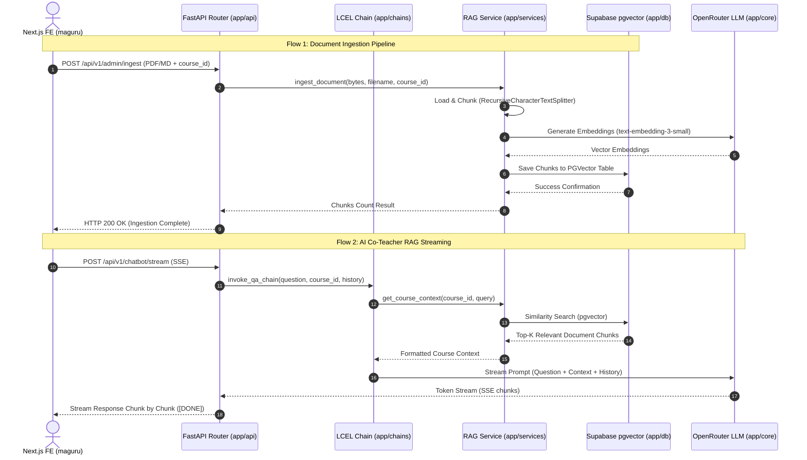

# Maguru AI Backend (`maguru-model`) Architecture Specification

**Author:** Technical Architecture Lead & AI Engineer  
**Date:** 27 Juli 2026  
**Status:** Approved Architectural Blueprint  

---

## 🏛️ Executive Architecture Overview

`maguru-model` adalah layanan microservice berbasis Python (FastAPI + LangChain / LangServe) yang memproses seluruh kapabilitas AI pada platform **Maguru**, termasuk:
1. **RAG (Retrieval-Augmented Generation)**: Ingestion & Vector Retrieval materi kursus berbasis `pgvector` Supabase.
2. **AI Co-Teacher Chatbot**: Pendampingan siswa berkonteks materi kursus via streaming SSE (*Server-Sent Events*).
3. **Code Explanation & Hint Generation**: Penjelasan cuplikan kode & pemberian petunjuk bertahap (*scaffolded hints*).
4. **Quiz & Assessment Feedback**: Evaluasi & umpan balik otomatis pada jawaban kuis/assessment siswa.

---

## 📐 Design Principles (Clean Architecture for AI Services)

Architecture `maguru-model` mengadopsi **Clean Modular Architecture** dengan memisahkan concern ke dalam beberapa layer utama:

1. **API Layer (`app/api/`)**: Menangani HTTP request/response, validation, CORS, dan SSE Streaming.
2. **Chain Layer (`app/chains/`)**: Berisi rantai logika AI terisolasi (*LCEL - LangChain Expression Language*).
3. **Service Layer (`app/services/`)**: Menangani business logic, document processing, text chunking, dan RAG retrieval.
4. **Infrastructure Layer (`app/db/` & `app/core/`)**: Mengelola koneksi PostgreSQL/pgvector, LLM client, dan konfigurasi env.
5. **Schema Layer (`app/schemas/`)**: Definisi Pydantic DTO (Data Transfer Objects) untuk tipe data yang tepat.

---

## 📁 Standard Directory Structure Blueprint

```text
maguru-model/
├── app/                         # Core Application Package
│   ├── __init__.py
│   ├── main.py                  # FastAPI Application Factory & Lifespan Handler
│   │
│   ├── core/                    # System Configurations & Singletons
│   │   ├── __init__.py
│   │   ├── config.py            # Pydantic BaseSettings (.env loader)
│   │   ├── logging.py           # Structured Logging Setup
│   │   └── llm.py               # OpenRouter / OpenAI Provider Client
│   │
│   ├── db/                      # Vector Store & PostgreSQL Connections
│   │   ├── __init__.py
│   │   └── vector_store.py      # PGVector Connection Pool & Collection Config
│   │
│   ├── services/                # Business & RAG Logic
│   │   ├── __init__.py
│   │   ├── rag_service.py       # Ingestion, Chunking, & Vector Search
│   │   └── chat_service.py      # Session Context Management
│   │
│   ├── chains/                  # LangChain LCEL Pipelines
│   │   ├── __init__.py
│   │   ├── qa_chatbot.py        # Course Q&A RAG Chain
│   │   ├── explain_code.py      # Code Explanation Chain
│   │   ├── hint_generator.py    # Micro-Hint Chain
│   │   ├── quiz_feedback.py     # Quiz Feedback Chain
│   │   └── ai_greeting.py       # Student Greeting Chain
│   │
│   ├── prompts/                 # Externalized YAML Prompt Templates
│   │   ├── qa_chatbot.yaml
│   │   ├── explain_code.yaml
│   │   ├── hint_generator.yaml
│   │   └── quiz_feedback.yaml
│   │
│   ├── api/                     # FastAPI Routes & LangServe Endpoints
│   │   ├── __init__.py
│   │   ├── router.py            # Aggregated APIRouter
│   │   └── v1/
│   │       ├── __init__.py
│   │       ├── ingest.py        # POST /api/v1/admin/ingest
│   │       ├── chat.py          # POST /api/v1/chatbot/stream
│   │       └── health.py        # GET /api/v1/health
│   │
│   └── schemas/                 # Pydantic Data Models
│       ├── __init__.py
│       ├── chat.py              # Chat Request / Response Schemas
│       └── ingest.py            # Ingestion Request / Response Schemas
│
├── tests/                       # Automated Test Suite
│   ├── conftest.py              # Pytest Fixtures & Mocks
│   ├── unit/                    # Unit Tests for Chains & Services
│   └── integration/             # E2E Endpoint & Vector DB Tests
│
├── docs/                        # Project Documentation
│   ├── architecture.md          # Document Architecture (This File)
│   └── api-reference.md         # API Contracts Specification
│
├── server.py                    # Legacy/Development Entry Point (Imports app.main)
├── requirements.txt             # Python Dependencies
├── pytest.ini                   # Pytest Configuration
└── README.md                    # Developer Guide
```

---

## 🔄 Data & Execution Flow



---

## 🛠️ Technical Stack & Dependencies

| Layer | Component | Package / Technology |
| :--- | :--- | :--- |
| **API Server** | Framework | `FastAPI`, `Uvicorn`, `sse-starlette` |
| **Orchestration** | Framework | `LangChain`, `LangServe`, `LangGraph` |
| **Vector DB** | Storage Engine | Supabase PostgreSQL + `pgvector` (`pgvector`, `psycopg2-binary`) |
| **Embedding & LLM**| Model Provider | OpenRouter API (`google/gemma-7b-it`, `text-embedding-3-small`) |
| **Data Processing**| Loaders & Splitters | `pypdf`, `tiktoken`, `python-multipart` |
| **Testing** | Suite | `pytest`, `pytest-cov`, `pytest-asyncio` |

---

## 🎯 Migration Strategy (Backward Compatibility)

Untuk mempertahankan kompatibilitas dengan skrip yang sudah ada saat ini:
1. `server.py` di root directory dipertahankan sebagai file pembungkus (*wrapper*) yang memanggil `from app.main import app`.
2. Seluruh rantai LCEL (`qa_chatbot`, `explain_code`, `hint_generator`, `quiz_feedback`, `ai_greeting`) direfaktor secara bertahap ke dalam struktur package `app/chains/`.
