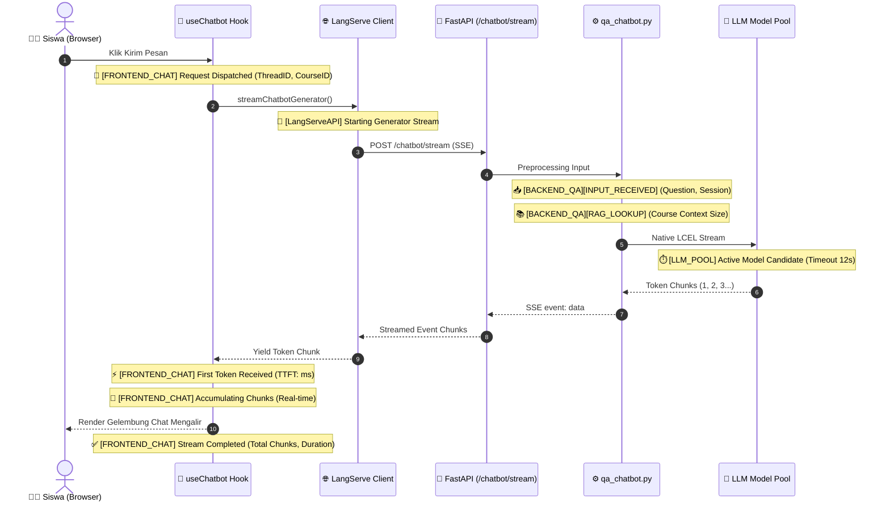

Kami telah menambahkan **Log Tracing & Debugging Komprehensif (End-to-End Traceability)** di seluruh lapisan sistem (dari **Frontend Next.js ➔ LangServe API ➔ Backend LCEL ➔ LLM Model Pool**):

---

### 🔍 Ringkasan Titik Log Baru (*Trace Points Map*):

---

### 🛠️ Rincian Log yang Ditambahkan:

#### 1. Lapisan Frontend ([`useChatbot.ts`](file:///d:/.maguru/maguru/features/langserve/chatbot/hooks/useChatbot.ts))
* 🚀 **`[FRONTEND_CHAT] Request Dispatched to AI Backend`**: Menampilkan `threadId`, `courseId`, `sessionTitle`, dan potongan pertanyaan.
* ⚡ **`[FRONTEND_CHAT] First Token Received`**: Menghitung secara otomatis *Time-To-First-Token* (TTFT dalam milidetik).
* ✅ **`[FRONTEND_CHAT] Stream Completed`**: Menampilkan ringkasan total potongan (*chunks*), jumlah karakter teks balasan, dan durasi total *streaming*.
* 🧹 **`[FRONTEND_CHAT] Chat history cleared`**: Mencatat saat pengguna me-reset chat dan membuat `thread_id` sesi baru.

#### 2. Lapisan Backend AI ([`qa_chatbot.py`](file:///D:/.maguru/maguru-model/app/chains/qa_chatbot.py))
* 📥 **`[BACKEND_QA][INPUT_RECEIVED]`**: Mencatat request yang masuk ke server Python beserta parameter lengkap.
* 📚 **`[BACKEND_QA][RAG_LOOKUP]`**: Menampilkan status pencarian materi kursus di vector store dan panjang konteks yang disisipkan.
* 🚀 **`[BACKEND_QA][PIPELINE_READY]`**: Mencatat durasi waktu pra-pemrosesan (dalam ms) sebelum dialirkan ke LLM.

#### 3. Lapisan Provider LLM ([`llm.py`](file:///D:/.maguru/maguru-model/app/core/llm.py))
* 🛡️ **`[LLM_POOL]`**: Inisialisasi pool model cepat (`cohere/north-mini-code:free`, `minimax/minimax-m3:free`, `dots-studio/dots-3-note-preview:free`) dengan proteksi **Timeout 12 Detik** dan **Max Retries 1**.
* 🔄 **`[LLM_INIT]`**: Mencatat failover otomatis jika model utama sedang antre.

---

### 🧪 Cara Melihat Alur Prosesnya Secara Live:
1. Buka halaman belajar di browser **`http://localhost:3001/course/[slug]/learn`**.
2. Buka **DevTools Console** browser (`F12` ➔ Tab *Console*).
3. Buka jendela terminal backend `maguru-model` di samping browser.
4. Kirim pertanyaan ke **AI Co-Teacher**. Anda akan melihat log alur dari tombol diklik hingga token kata per kata mengalir masuk ke UI secara terperinci dan transparan!